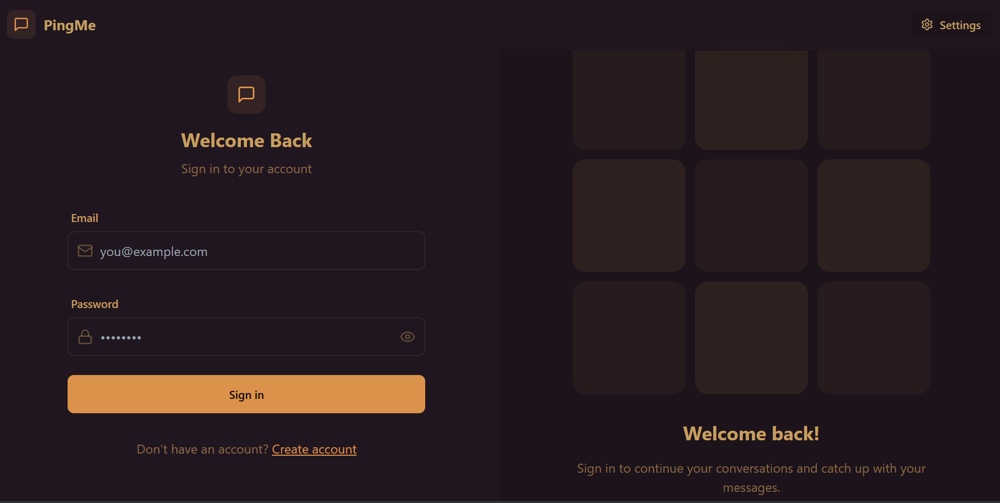
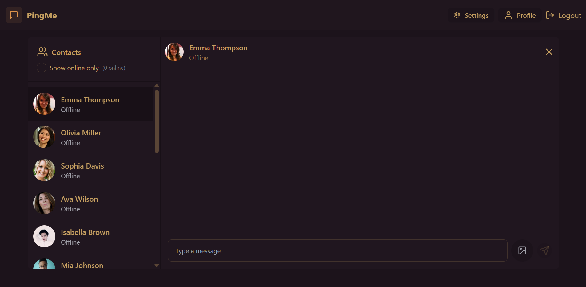

# 💬 PingMe - Realtime Chat App

Welcome to **PingMe**! This repository hosts a real-time chat application developed using the **MERN** stack. PingMe allows seamless 1-on-1 messaging with real-time updates, authentication, and UI customization through 30+ themes.

---
## LINK : 
https://pingme-i1pq.onrender.com

## 📑 Table of Contents

* [Overview](#-overview)
* [Technologies](#-technologies)
* [Packages & Libraries Used](#-packages--libraries-used)
* [Getting Started](#-getting-started)
* [Features](#-features)
* [Demo & Screenshots](#-demo--screenshots)
* [Acknowledgments](#-acknowledgments)
* [License](#-license)

---

## 🌟 Overview

**Description**:
**PingMe** is a real-time messaging platform inspired by modern messaging apps. It features secure user authentication, online user tracking, private chats, and customizable themes using `daisyUI`.

---

## 💻 Technologies

Here’s a breakdown of the core technologies used in this project:

* **Frontend**: React.js
* **Backend**: Node.js, Express.js
* **Database**: MongoDB (via Mongoose)
* **Real-time**: Socket.io

---

## 📦 Packages & Libraries Used

| Package / Library      | Purpose                         |
| ---------------------- | ------------------------------- |
| Express.js             | Backend framework               |
| Mongoose               | MongoDB object modeling         |
| Bcrypt                 | Password hashing                |
| JWT                    | Authentication                  |
| Socket.io              | Real-time messaging             |
| React Router DOM       | Client-side routing             |
| DaisyUI + Tailwind CSS | UI theming and styling          |
| Body-Parser            | Parsing incoming request bodies |
| CORS                   | Enable cross-origin requests    |
| Axios                  | API requests                    |

---

## 🚀 Getting Started

Follow these steps to set up PingMe locally:

### 1. Clone the repository:

```bash
git clone https://github.com/gauravag18/PingMe.git
```

### 2. Install dependencies:

```bash
cd backend
npm install

cd ../frontend
npm install
```

### 3. Configure environment variables:

Create a `.env` file inside the `backend` directory:

```
PORT=5001
MONGO_URI=your_mongodb_uri
JWT_SECRET=your_jwt_secret
CLOUDINARY_CLOUD_NAME =
CLOUDINARY_API_KEY = 
CLOUDINARY_API_SECRET = 
```

### 4. Run the application:

#### Backend

```bash
cd backend
npm start
```

#### Frontend

```bash
cd frontend
npm start
```

---

## 🎯 Features

* ✅ User Registration & Login
* 🔒 Secure JWT-based Authentication
* 🔄 Real-Time Messaging with Socket.io
* 👤 User Online Status Indicator
* 🎨 30+ Tailwind/DaisyUI Themes
* 📁 Profile Management
* 🧑‍🤝‍🧑 One-on-One Messaging Interface

---

## 🔗 Demo & Screenshots

### 🏠 Profile Page


### 🔐 Login Page


### 💬 Chat Interface


### 🏠 Themes


> 📌 *Demo credentials : *
   Email : demo@gmail.com
   Username : Demo Account
   Password : demo@123

---

## 🙏 Acknowledgments

* Inspired by modern messaging platforms like WhatsApp and Messenger.
* Special thanks to **Tailwind CSS** and **daisyUI** for beautiful UI components.

---

## 📜 License

This project is licensed under the **MIT License**. See the `LICENSE` file for more details.

---

### 💡 Contribute

Pull requests are welcome! For major changes, please open an issue first to discuss what you would like to change.
